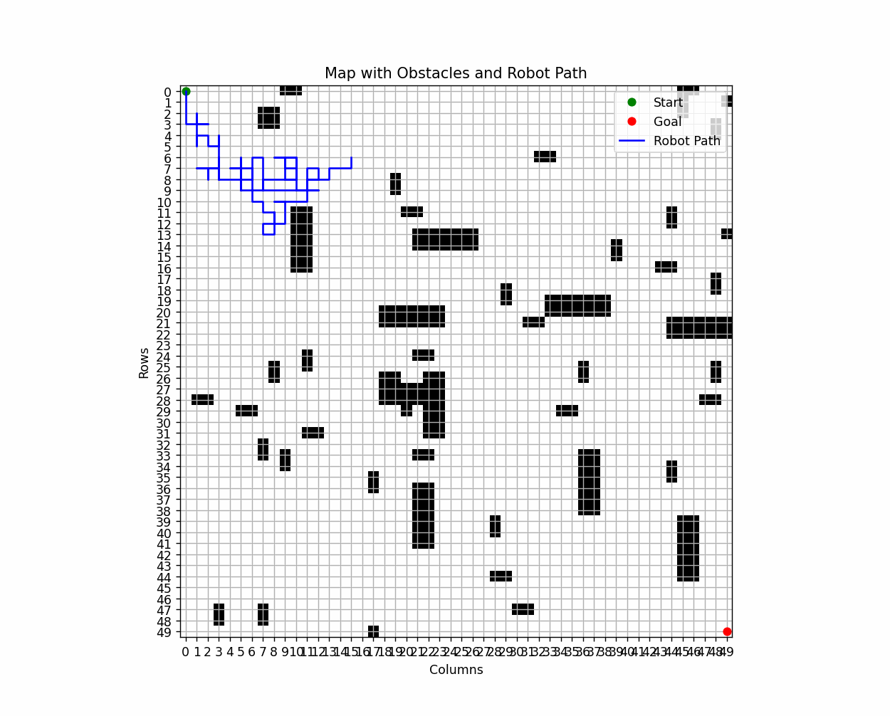

# Genetic Algorithm for Pathfinding Robot

## Screenshots

## Description
This project uses a genetic algorithm to find an optimal path for a robot in a grid environment filled with obstacles. The robot starts at the top-left corner of the grid and aims to reach the bottom-right corner, avoiding obstacles along the way. The solution is represented as a sequence of commands (genome), which is evolved over generations using genetic operators such as selection, crossover, and mutation.

The robot is simulated on a 50x50 grid, and obstacles are randomly placed. The genetic algorithm evaluates the "fitness" of each genome based on how close the robot can get to the goal without colliding with obstacles. The robot's path is then visualized on the map, and its progress through generations is shown with plots.

## Features
- **Grid-based Navigation**: The robot navigates a 50x50 grid with randomly placed obstacles.
- **Genetic Algorithm**: The algorithm evolves a population of possible movement sequences (genomes) using selection, crossover, and mutation.
- **Path Visualization**: The robot’s path is animated, showing its movement from start to goal.
- **Fitness Evaluation**: The robot’s fitness is determined by the distance to the goal and the avoidance of obstacles.

## How It Works
1. **Genome Representation**: Each individual in the population represents a sequence of movement commands (e.g., "straight", "right", "left", "u-turn").
2. **Selection**: The best genomes are selected based on their fitness, which includes distance from the goal and collision penalties.
3. **Crossover**: Two parent genomes are combined to create child genomes that inherit traits from both parents.
4. **Mutation**: Random mutations are applied to genomes to explore new possible solutions.
5. **Fitness Calculation**: The fitness of a genome is calculated by simulating the robot’s movement and evaluating its distance from the goal and any collisions with obstacles.

## Technologies Used
- **Python**: The primary programming language.
- **NumPy**: For handling arrays and numerical calculations.
- **Matplotlib**: For visualizing the robot’s movement and fitness progress.
- **Random**: For generating random genomes and obstacles.
  
## Requirements
- Python 3.x
- NumPy
- Matplotlib

## Results
The progress of the genetic algorithm is visualized using:
- **Animation**: The robot’s journey over time is displayed as an animation.
- **Fitness Progress**: A graph of the algorithm's progress in terms of the best fitness value over generations.
- **3D Parameter Evolution**: A 3D plot visualizing the evolution of the parameters of the best genomes through generations.

